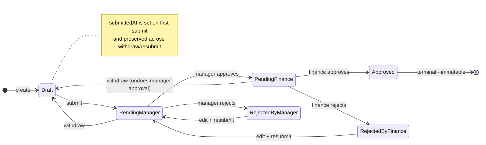
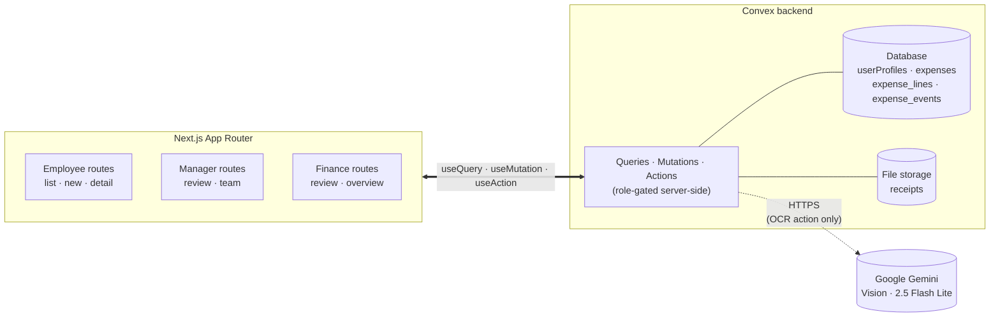

<div align="center">

# Expense Tracker

**A small but production-quality expense tracker** with employee submission and a two-step approval chain — Manager → Finance.

[](https://nextjs.org)
[](https://www.typescriptlang.org)
[](https://convex.dev)
[](https://tailwindcss.com)
[](https://ui.shadcn.com)
[](https://ai.google.dev)

</div>

---

## What's inside

An internal expense reporting tool built end-to-end on **Next.js (App Router)** and **Convex** (database, server functions, file storage, and auth). Employees submit itemized expenses with receipts; managers and finance approve through a fixed two-step chain; the full history is auditable in-app.

Receipt OCR is wired with **Google Gemini Vision** — upload a real receipt, click _Auto-fill from receipt_, and the line items populate themselves.

The role-aware UX, full audit trail, and finance analytics dashboard set it apart from a typical "approval workflow demo."

---

## Live demo

> [!IMPORTANT]
> **URL:** _<deployed Vercel URL>_
>
> All three accounts below are pre-seeded on the production deployment. Sign in as any role to see what they see.

| Role | Email | Password |
|---|---|---|
| Employee | `employee@example.com` | `employee123!` |
| Manager | `manager@example.com` | `manager123!` |
| Finance | `finance@example.com` | `finance123!` |

The seed creates five expenses — one in each of the five lifecycle states — so every role lands on something interesting.

---

## Highlights

| Area | What's notable |
|---|---|
| **Two-step approval chain** | Manager → Finance, both can reject with a required reason. Rejected expenses can be edited and resubmitted; resubmit always restarts at step 1. |
| **Itemized line items** | Each expense is composed of lines (description · category · qty · unit price). Parent holds shared context (summary, currency, date, merchant, receipt). |
| **Gemini OCR auto-fill** | Upload a receipt, hit one button, get extracted line items via `gemini-2.5-flash-lite` with strict JSON-schema output. |
| **Full audit timeline** | Every action (create, submit, edit, approve, reject, withdraw, resubmit) is recorded with actor, role, and timestamp. Bulk line edits share a `saveGroupId` so the timeline can collapse them. |
| **Finance analytics dashboard** | KPI strip (Approved YTD / Queue / Rejected / Approval rate), spend-by-category bars, top submitters. Multi-currency aware. |
| **Mobile-first responsive** | Card layouts on `<md`, table layouts on `≥md`. Sticky action bars, kebab menus for destructive secondary actions, full-width primary CTAs. |
| **Server-side authorization** | Every Convex function calls `auth.getUserId(ctx)` first, then a role/ownership helper. Client never passes role or userId. |
| **Seven currencies** | USD · EUR · GBP · CAD · AUD · JPY · PHP. No FX conversion — totals are scoped per currency. |

---

## State machine

The expense lifecycle, rendered live by GitHub:



---

## Three flows verified end-to-end

> [!NOTE]
> All three were exercised on the live deployment via browser automation. Each transition produces a history event and updates the relevant status badges.

<details open>
<summary><strong>1. Full approval</strong></summary>

Employee submits → manager approves → finance approves.
Status: `draft` → `pending_manager` → `pending_finance` → `approved`.

The approved expense becomes immutable. Both approvers' notes are preserved in the history timeline.

</details>

<details open>
<summary><strong>2. Reject and resubmit</strong></summary>

Employee submits → manager rejects → employee edits and resubmits → manager approves → finance approves.
Status: `pending_manager` → `rejected (manager)` → `pending_manager` → `pending_finance` → `approved`.

The rejection reason stays in the history alongside the resubmission events.

</details>

<details open>
<summary><strong>3. Manager-approves, finance-rejects</strong></summary>

Employee submits → manager approves → finance rejects with reason → expense ends at `rejected (finance)`.

Finance still sees the original manager-approval block on the detail page; finance rejection banner explains the terminal state.

</details>

---

## Quick start

```bash
git clone https://github.com/nemeCIS6/airdev-exercise-monorepo
cd airdev-exercise-monorepo/apps/web

npm install
npx convex dev                  # creates a Convex deployment, prompts for project setup
cp .env.example .env.local      # fill in the values printed by `convex dev`
npx convex run seed:run         # seeds Eddie/Morgan/Fiona + 5 expenses (idempotent)
npm run dev                     # http://localhost:3000
```

**Convex Auth setup** (one-time, before first `npm run dev`):

```bash
npx @convex-dev/auth
```

…and follow the [setup guide](https://labs.convex.dev/auth/setup) to generate `JWT_PRIVATE_KEY` and `JWKS` (stored as Convex deployment env vars, not in `.env.local`).

**Gemini OCR** (optional, for the receipt auto-fill feature):

```bash
# Get a key from https://aistudio.google.com/apikey
npx convex env set GEMINI_API_KEY <your-key>
```

---

## How it works



Every Convex function checks the caller's identity and role before touching data. Mutations diff and write events atomically — line edits in a single save share a `saveGroupId` so the timeline can group them visually. The Gemini OCR action is the only outbound network call from the backend.

---

## Tech stack

- [**Next.js 15**](https://nextjs.org) (App Router) with TypeScript and strict mode
- [**Convex**](https://convex.dev) — reactive database, server functions, file storage, and [Convex Auth](https://labs.convex.dev/auth) (Password provider)
- [**Tailwind CSS**](https://tailwindcss.com) for styling
- [**shadcn/ui**](https://ui.shadcn.com) primitives (Button, Card, Select, Popover, Dialog, AlertDialog, Table, ...)
- [**Lucide**](https://lucide.dev) icons
- [**Sonner**](https://sonner.emilkowal.ski) for toast notifications
- [**Google Gemini**](https://ai.google.dev) `gemini-2.5-flash-lite` for receipt OCR

---

## Design decisions

<details>
<summary><strong>Approval pipeline, not payment tracker</strong></summary>

v1 ends at Approved / Rejected. Reimbursement, AP integration, and payment status tracking are future scope. The terminal `approved` state is intentionally immutable so audit can rely on it.

</details>

<details>
<summary><strong>Fixed two-step approval chain (Manager → Finance)</strong></summary>

Every expense must be approved by the employee's assigned manager and then by a member of the finance pool. Either step can reject.

The schema (status enum + per-step decision fields) is designed so the chain can be made configurable in v2: a future `approval_chains` table could hold per-employee, per-amount, or per-category chains, and `expenses` could track a `currentStep` integer.

</details>

<details>
<summary><strong>Finance is a shared pool</strong></summary>

Any user with the `finance` role can act at step 2 — first-come, first-decide. Direct-report scoping only applies at the manager step.

</details>

<details>
<summary><strong>Review pages show full history, not just inboxes</strong></summary>

Managers see every submitted expense from their direct reports across all statuses; finance sees every submitted expense in the company (drafts always stay private to the submitter). The status filter defaults to the pending queue (`pending_manager` / `pending_finance`) so the queue view is one click away, but clearing the filter reveals the full audit trail — matching how real expense tools (Brex, Ramp, Expensify) treat the financial-controller role.

</details>

<details>
<summary><strong>Resubmit always restarts at step 1</strong></summary>

Even if finance rejected, the manager reviews again. Conservative choice — finance concerns are often shared by the manager, and skipping the manager on resubmit would be surprising.

</details>

<details>
<summary><strong>One manager per employee</strong></summary>

Configurable from the manager's Team page. Designed to extend to chained or branched approval graphs later.

</details>

<details>
<summary><strong>Self-serve signup creates employees only</strong></summary>

Manager and finance accounts are seeded. Promotion is admin work, out of v1 scope.

</details>

<details>
<summary><strong>Expenses are composed of line items</strong></summary>

Each line carries its own category and amount; the parent holds shared context (summary, currency, date, merchant, receipt). This reflects how itemized receipts actually work — a single dinner check may include food, drinks, and tip under different policies. The seed's rejected expense exists precisely to demonstrate this ("Please itemize and resubmit.").

</details>

<details>
<summary><strong>Drafts persist explicitly</strong></summary>

Save Draft button + browser warn-on-navigate. Chosen over debounced autosave because the visible button advertises the feature to reviewers and avoids edge cases (race conditions, orphan drafts) in a tight build window.

</details>

<details>
<summary><strong>History as a separate table</strong></summary>

`expense_events` keeps the audit trail queryable and immutable without bloating the expense record. Events capture `actorRoleAtTime` so the audit remains accurate even if a user's role changes later. Line-level events share a `saveGroupId` so the timeline collapses same-save events into one expandable entry.

</details>

<details>
<summary><strong>Fixed category and currency lists</strong></summary>

Seven currencies (USD, EUR, GBP, CAD, AUD, JPY, PHP), six categories (travel, meals, lodging, software, supplies, other). Forward-compatible with the brief's "different countries" hint without committing to 180 ISO codes.

</details>

<details>
<summary><strong>All state lives in Convex</strong></summary>

No `localStorage`, no in-memory mock stores. Convex queries drive every list and detail page; mutations are the only writer.

</details>

<details>
<summary><strong>Authorization is server-side</strong></summary>

Every Convex function calls `auth.getUserId(ctx)` first, then a role/ownership helper. The client never passes role or userId.

</details>

---

## Assumptions

- Single company / single tenant. Multi-org is not in v1.
- Currency is stored per-expense (not per line) but **not** converted. FX is future scope.
- Every expense has at least one line item. The form starts new drafts with one empty line.
- Managers and finance users cannot submit expenses in v1. Clean role separation; the data model supports adding it later.
- Rejection requires a reason (5–500 chars). Approval notes are optional at both steps.
- Approved expenses are immutable. Rejected expenses are editable and resubmittable; resubmit always restarts at the manager step.
- Withdraw is available from both `pending_manager` and `pending_finance` — withdrawing from `pending_finance` undoes the manager's prior approval.
- Receipts are required on submit (image or PDF, ≤10MB) at the parent level — one receipt per expense, regardless of line count.
- `submittedAt` is set once on first submission and survives withdraw/resubmit cycles.
- No notifications. Status is reflected in-app.

---

## Out of scope for v1

Payment tracking · configurable approval chains (chain is fixed at Manager → Finance) · approval routing by amount/category · multi-currency FX · admin role · notifications · social login · CSV export · field-level audit diffs.

---

## Project structure

```
airdev-exercise-monorepo/
├── README.md
├── plan/                          # spec + design prototype + handoff docs
└── apps/web/                      # Next.js app + Convex backend (single workspace)
    ├── app/
    │   ├── (employee)/expenses/   # /expenses, /expenses/new, /expenses/[id]
    │   ├── (manager)/             # /review, /review/[id], /team
    │   ├── (finance)/finance/     # /finance/review, /finance/review/[id], /finance/overview
    │   ├── sign-in, sign-up, onboarding
    │   └── layout.tsx, page.tsx
    ├── components/                # ExpenseForm, LineItemsSection, HistoryTimeline,
    │   │                          # ApproverActionBar, EmployeeActionBar, StatusBadge,
    │   │                          # RoleGuard, ErrorBoundary, ExpenseList, ExpenseFilters
    │   └── ui/                    # shadcn primitives (Button, Card, Select, …)
    ├── convex/
    │   ├── schema.ts              # userProfiles · expenses · expense_lines · expense_events
    │   ├── auth.ts                # Convex Auth (Password provider)
    │   ├── users.ts               # getMyProfile, completeOnboarding, listMyTeam,
    │   │                          # listAllEmployees, listAllManagers, reassignEmployeeManager
    │   ├── expenses.ts            # createDraft, saveDraftWithLines, submitExpense,
    │   │                          # withdrawExpense, resubmitRejected, discardDraft,
    │   │                          # managerApprove/Reject, financeApprove/Reject,
    │   │                          # listMyExpenses, listExpensesForReview, getExpense,
    │   │                          # callerOwnsDraftWithReceipt (gates OCR action)
    │   ├── events.ts              # listEventsForExpense
    │   ├── files.ts               # generateUploadUrl, getReceiptUrl
    │   ├── ai.ts                  # extractLinesFromReceipt (Gemini OCR action)
    │   ├── seed.ts                # idempotent seed: 3 users + 5 expenses (one per status)
    │   └── lib/auth.ts            # role/ownership helpers
    └── lib/                       # format helpers, useUnsavedChanges hook
```

---

<div align="center">

Built for the [Airdev](https://airdev.co) technical exercise · Spec source-of-truth at [`plan/expense-tracker-spec.md`](./plan/expense-tracker-spec.md)

</div>
